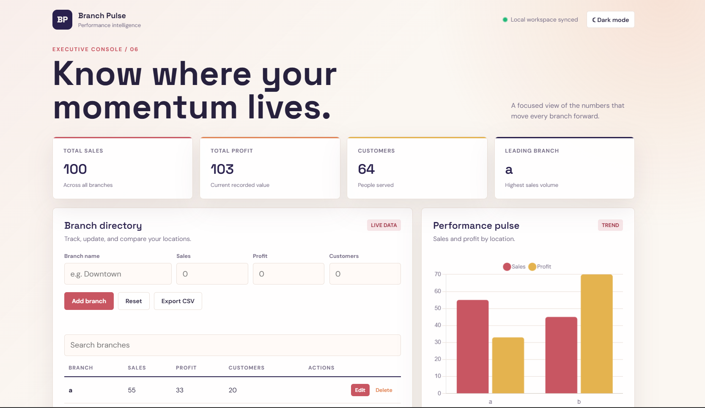
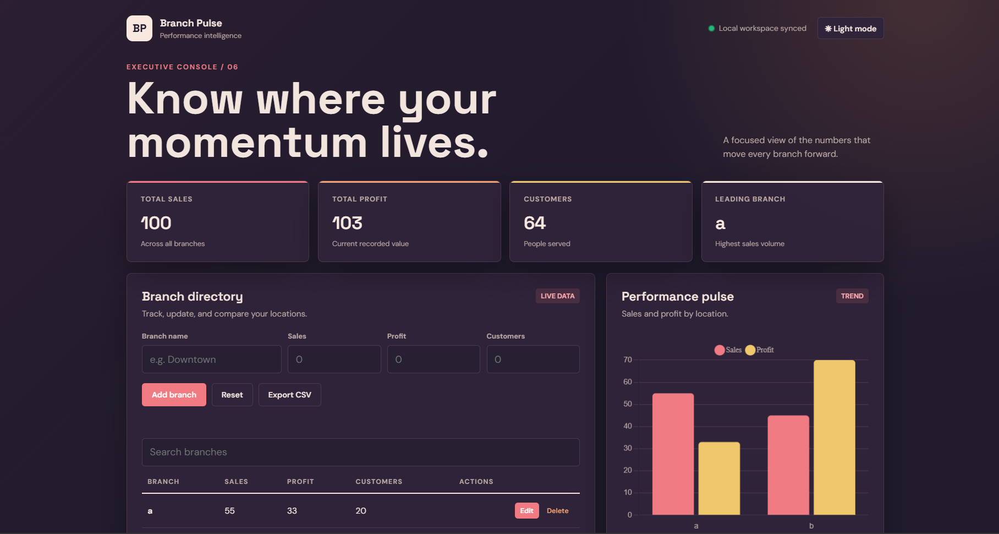

# Branch Performance Comparison Dashboard


## Project Preview


its a program that compare different branches within a company on the basis of some matric  
# Branch Performance Comparison Dashboard

A simple browser-based dashboard for comparing company branches using sales, profit, and customer metrics.

## Features

- Add and edit branch data
- Delete branches
- Search for branches
- Compare sales and profit with a chart
- View total sales, profit, and customers
- Automatically save data in browser local storage
- Export branch data as a CSV file
- Responsive layout for desktop and mobile







## How to Run

1. Download or clone this project.
2. Open `index.html` in a web browser.
3. Add branch information using the form.


## How to Run

No installation or server is required.

1. Download or clone this repository.
2. Open the project folder in VS Code.
3. Open  `test6.html` in a web browser.
4. Add branch information using the form.

You can also open a page from PowerShell:

```powershell
Start-Process .\index.html
```

## How to Use

1. Enter a branch name.
2. Enter the sales, profit, and customer values.
3. Select **Add branch**.
4. Use **Edit** to update a branch.
5. Use **Delete** to remove a branch.
6. Use the search box to find a branch.
7. Select **Export CSV** to download the data.


## Technologies Used

- HTML
- CSS
- JavaScript
- Chart.js
- Browser Local Storage


## Data Fields

Each branch record contains:
- Branch name
- Sales
- Profit
- Number of customers

## Important Notes

Branch data is saved only in the current browser. Clearing browser storage or changing browsers can remove or hide saved data.

The charts use Chart.js from a CDN, so an internet connection may be needed for charts to load.


## Limitations

Data is stored only in the current browser. Clearing browser storage will remove the saved branch data.
- Add sorting by sales, profit, or customers
- Add user accounts and cloud storage
- Add more chart types
- Add downloadable PDF reports

## Author

Created by Mustafa.
